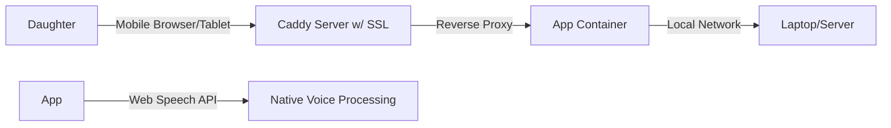

This document outlines the architecture and design for a low-friction, gamified homework "terminal." As a Solutions Architect, the goal here is **Zero-Toil Maintenance**: no database, no persistent storage beyond a session, and a "Configuration over Code" approach for the weekly word lists.

---

# Project PLUS ULTRA: Homework Mission Control

## 1. Executive Summary
A lightweight, web-based internal tool designed to gamify Grade 2 level English, Afrikaans, and Math homework. The application uses browser-native **Speech-to-Text (STT)** to validate pronunciation and provides high-resonance audio/visual feedback based on the user's favorite media (*Minecraft, Spy x Family, My Hero Academia*).

## 2. Technical Stack
* **Frontend:** Vite + TypeScript (React or Vanilla).
* **Speech Engine:** Web Speech API (`webkitSpeechRecognition`).
* **Infrastructure:** Dockerized container hosted behind **Caddy** (utilizing existing automated SSL for microphone permissions).
* **State Management:** In-memory (Single Session). Data input via a simple "Mission Briefing" text area.

---

## 3. The "Game Loop" Logic

The mission is structured as a **Linear Raid**. The word list is shuffled on start to ensure variety, but the milestones remain fixed for psychological pacing.

### A. The Input Stage (The Briefing)
* A simple `textarea` where you paste the week’s words (comma-separated or line-separated).
* Toggle switches for **Mode**: [English (Pronounce)] | [Afrikaans (Translate/Read)] | [Math (Counting)].

### B. The Combat Stage (The Words)
* **The UI:** Large, clear typography. A "Microphone" icon that pulses when listening.
* **The Matcher:** A fuzzy-matching algorithm to account for "7-year-old pronunciation" (e.g., using Levenshtein distance).

### C. The Milestone Audio/Visual Flair
| Milestone | Audio Cue | Visual Effect |
| :--- | :--- | :--- |
| **Standard Word** | Minecraft XP "Ding" | Small green XP orbs float up. |
| **50% Completion** | Anya’s "Waku Waku!" | Screen tint shifts to pink; Star (Stellarium) appears. |
| **Final Word** | All Might’s "DETROIT SMASH!" | Screen shake + "Plus Ultra" confetti (MHA style). |

---

## 4. Mode-Specific Mechanics

### English: "Hero Certification"
* **Action:** The app displays the word. 
* **Requirement:** She must write the word on her paper (physical task) then press the "Speak" button to pronounce it.
* **Validation:** Match the STT output to the target word.

### Afrikaans: "Telepathic Decryption" (Spy x Family)
* **Action:** The app shows the Afrikaans word (e.g., *Hond*).
* **Requirement:** She acts as "Anya" and speaks the **English meaning** ("Dog").
* **Validation:** The STT matches a pre-mapped translation dictionary.

### Math: "Creeper Countdown"
* **Action:** The app says: "Count by 5s from 0 to 50."
* **Requirement:** She counts aloud.
* **Validation:** This is the most complex for STT, so a "Manual Pass" button (The "Parental Override") can be used here, or a sequence check where the app listens for specific "milestone" numbers.

---

## 5. Deployment Architecture (The "DevOps" View)



### Key Considerations:
* **Privacy:** By using the Web Speech API, the voice processing happens locally in the browser (or via Google's internal browser services), keeping the data off your personal server.
* **Low Maintenance:** Since everything is in-memory, if the app crashes or the tab closes, you just paste the list back in. No DB migrations, no corrupted volumes.
* **Gymnastics Break:** Every 5 words, the app can trigger a "Random Gym Move" screen (e.g., "Do a forward roll to continue!").

---

## 6. Future "Hard-Tech" Integration
* **Physical Feedback:** Hook the app up to a local Webhook. When the "Detroit Smash" triggers, it could potentially send a command to a 3D-printer-controlled "flag" or a smart light in the room that flashes yellow and blue.
* **Obsidian Sync:** Eventually, the app could fetch the `words.json` directly from your Obsidian "Education" folder.

**Would you like me to draft a basic `App.tsx` snippet using the Web Speech API to get you started on the prototype?**

Yes, it absolutely does! Since you’re targeting a **Chrome/Edge** environment (which is best for this stack), Afrikaans is officially supported via the `af-ZA` locale.

Under the hood, Chrome uses Google’s cloud-based speech engine to handle the transcription, which is actually one of the more mature engines for South African accents and Afrikaans specifically.

### 1. Implementation Detail

To enable it in your script, you just need to set the `lang` property on your recognition object. Here is the specific snippet for your "Anya’s Secret Receiver" app:

TypeScript

```
const recognition = new webkitSpeechRecognition();
recognition.lang = 'af-ZA'; // Use 'en-ZA' for her English homework
recognition.continuous = false; // We want it to stop after one word/phrase
recognition.interimResults = false; // Only trigger when she's finished speaking
```

### 2. The "Architect" Gotchas

Since you're building this for a local network, keep these two things in mind:

- **Internet Dependency:** Unlike English (which sometimes has on-device models in Chrome), **Afrikaans usually requires a network connection**. The browser sends the audio fragment to Google's servers to process. If your Cape Town fibre goes down, the "Mission Control" terminal might lose its "hearing."
    
- **Fuzzy Matching for Kids:** Native Afrikaans speech recognition can be a bit "strict." Since she’s 7, I highly recommend using a library like `string-similarity` or a simple **Levenshtein distance** check.
    
    - _Example:_ If the target is _"Vliegtuig"_ and the STT returns _"vliegtuier"_ because she stumbled, your app should still give her the **"Waku Waku"** reward.
        

### 3. Testing it Right Now

If you want to see it in action before writing a single line of code:

1. Open Chrome on your Mac or PC.
    
2. Go to the [Google Translate](https://translate.google.com/) site.
    
3. Set the input to **Afrikaans**.
    
4. Click the **Microphone** icon and have her say a few words.
    

If that works well, your local app will work exactly the same way, as they share the same underlying engine.

Are you planning to build the frontend as a simple **Vite/React** app, or were you thinking of something even more lightweight like a single **HTML/Tailwind** file served by Caddy?